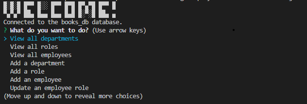
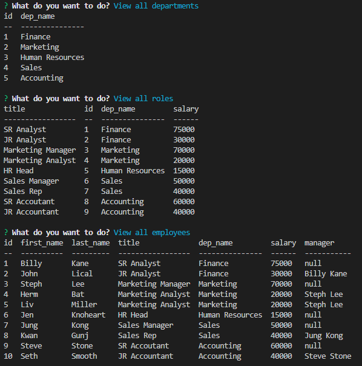

# Employee Tracker

## Description

The following challenge involved creating interfaces that allow non-developers to easily view and interact with information stored in databases. The application is a command-line application that tracks an employee database.
Within this application the user can:

-	View departments
-	View roles
-	View employees
-	Add a department
-	Add a role
-	Add an employee
-	Update an employee’s role

Link to Video of Application: https://www.loom.com/share/d5a494d000174c588db82451cdf5fe50

## Installation

Please install libraries and run on a console. Prior to starting the application, please open your local SQL server and run "schema.sql" & "seeds.sql" in the db folder.

The password for your local server should be entered in the index.js file

The application will be invoked by using the following command:

node index.js

## Technologies Used

- Node.js
- MySQL
- Inquirer
- Console Table

## License

none
